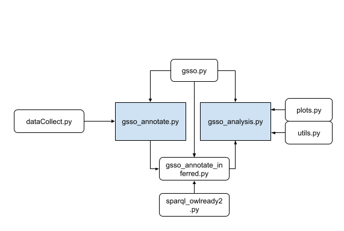

# Supporting Online Toxicity Detection with Knowledge Graphs

Authors: Paula Reyero Lobo ([paula.reyero-lobo@open.ac.uk](mailto:paula.reyero-lobo@open.ac.uk)), Enrico Daga ([enrico.daga@open.ac.uk](mailto:enrico.daga@open.ac.uk)), Harith Alani ([harith.alani@open.ac.uk](mailto:harith.alani@open.ac.uk))



The resulting output of this code corresponds to the directory tree bellow.  We release these files
in the following open [repository](https://doi.org/10.5281/zenodo.6379344):
```
icwsm22-supporting-toxicity-with-KG
│   readme.md  
└───data
│   │   all_data_splits.csv
│   │
│   └───gsso_annotations
│       │   file11.csv
│   └───gsso_annotations_inferred
│       │   file21.csv
│   │   identity_data_splits.csv
│   │   readme.md
└───results
│   └───1_freq_tables
│   └───2_freq_plots
│   └───3_freq_plots_category
│   └───4_candidate_scores
│   └───saved_dict
└───scripts
```

Set up the project using a virtual environment:

```bash
    $ python -m venv <env_name>
    $ source <env_name>/bin/activate
    (<env_name>) $ python -m pip install -r requirements.txt
```

Example usage:

Using the command line from project folder to detect gender and sexual orientation entities in the text:

```bash
    (<env_name>) $ python scripts/gsso_annotate.py
```

